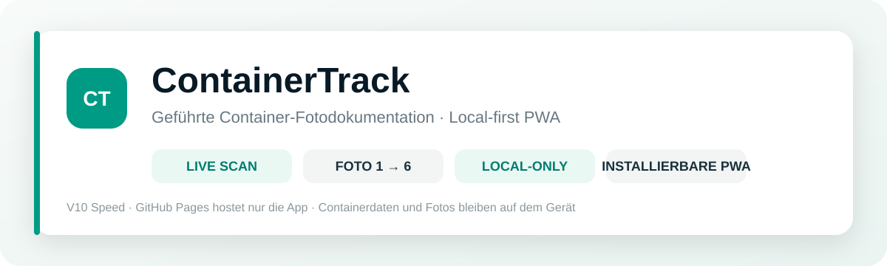

<p align="center">
  
</p>

<p align="center">
  
  
  
  
  
</p>

# ContainerTrack

**ContainerTrack** ist eine browserbasierte, installierbare PWA für die geführte Fotodokumentation von Containern.  
Die App wurde für einen möglichst schnellen mobilen Ablauf entwickelt: **Container-Nummer scannen → sechs Pflichtfotos in fester Reihenfolge → ZIP exportieren.**

> 🔒 **Local-only:** Containerdaten, Fotos und Verläufe werden ausschliesslich lokal im Browser des Geräts gespeichert.  
> GitHub Pages hostet nur die statischen App-Dateien und erhält keine Containerdaten oder Fotos.

---

## Workflow

```text
Container-Nummer live scannen
          ↓
Foto 1 – Leerer Innenraum
          ↓
Foto 2 – Aussenseite Front
          ↓
Foto 3 – Aussenseite Rückseite / Türen
          ↓
Foto 4 – Aussenseite links
          ↓
Foto 5 – Aussenseite rechts
          ↓
Foto 6 – Befüllter Innenraum / Kühlplatten
          ↓
Ablauf prüfen
          ↓
ZIP exportieren
```

Die Fotoreihenfolge ist **zwingend**. Ein späterer Schritt wird erst freigeschaltet, wenn der vorherige abgeschlossen wurde.

---

## Funktionen

| Bereich | Funktion |
|---|---|
| **LiveScan** | Container-Nummer direkt über die Smartphone-Kamera erfassen |
| **Speed-Modus** | Der erste gültige 4-stellige OCR-Treffer wird sofort übernommen |
| **Scanrahmen** | Die OCR wertet exakt den sichtbaren Scanbereich aus |
| **Kontrast-OCR** | Optimiert für weisse Zahlen auf blauem Container-Schild |
| **Fallback** | Foto-OCR bleibt als Alternative zum LiveScan vorhanden |
| **Feste Reihenfolge** | Foto 1 bis Foto 6 können nicht übersprungen werden |
| **Retake-Schutz** | Nur der zuletzt aufgenommene Schritt kann direkt zurückgesetzt werden |
| **Automatische Benennung** | Bilder werden automatisch anhand der Container-Nummer benannt |
| **Fortschritt** | Pflichtfotos, offene Fotos und lokaler Speicherverbrauch werden angezeigt |
| **Vollständigkeitsprüfung** | Warnung, wenn beim Abschluss noch Aufnahmen fehlen |
| **Lokale Verläufe** | Angefangene und abgeschlossene Container bleiben lokal gespeichert |
| **Bildkomprimierung** | Aufnahmen werden für mobile Nutzung lokal optimiert |
| **ZIP-Export** | Vollständige Dokumentation wird lokal als ZIP erzeugt |
| **PWA** | App kann auf Android/Chrome und unterstützten Browsern installiert werden |
| **Offline App-Shell** | Oberfläche wird über Service Worker lokal gecacht |
| **Keine Cloud-Datenbank** | Kein Firebase, Firestore, Supabase oder Backend |
| **Keine API-Kosten** | Keine kostenpflichtigen APIs erforderlich |
| **GitHub Pages** | Vollständig als statische Web-App hostbar |

---

## Pflichtfotos

Die aktuelle Version verlangt genau **6 Fotos**:

1. **Leerer Innenraum**  
   Gesamtansicht des leeren Containers von der geöffneten Tür aus.

2. **Aussenseite – Front**  
   Frontseite möglichst vollständig und gerade im Bild.

3. **Aussenseite – Rückseite / Türen**  
   Türen, Verschlüsse und Rückseite vollständig dokumentieren.

4. **Aussenseite – links**  
   Linke Seitenwand inklusive Ecken.

5. **Aussenseite – rechts**  
   Rechte Seitenwand inklusive Ecken.

6. **Befüllter Innenraum**  
   Gesamtansicht des mit Kühlplatten befüllten Containers.

---

## Dateinamen

Die exportierten Bilder enthalten **nur die Container-Nummer** und die laufende Fotonummer.

Beispiel für Container `0708`:

```text
0708_01.jpg
0708_02.jpg
0708_03.jpg
0708_04.jpg
0708_05.jpg
0708_06.jpg
```

Das ZIP wird ebenfalls anhand der Container-Nummer erzeugt.

---

## LiveScan / OCR

### Erwartetes Format

ContainerTrack sucht beim LiveScan nach einer **4-stelligen Container-Nummer**:

```text
0708
1483
0236
```

Führende Nullen bleiben erhalten.

### Speed-Modus

Seit **V10** gibt es keine Mehrfachbestätigung mehr.

Früher:

```text
Treffer → nochmals prüfen → nochmals prüfen → übernehmen
```

Aktuell:

```text
Erster gültiger 4-stelliger Treffer → sofort übernehmen
```

Dadurch wird der Scan im Arbeitsablauf deutlich schneller.

### Bildaufbereitung

Der Scanner verwendet mehrere lokale Bildaufbereitungen:

- Graustufen
- Kontrastverstärkung
- Schwarz/Weiss-Schwellenwert
- invertierte Darstellung
- Hochskalierung des Scanbereichs
- OCR-Zeilenmodus
- Ziffern-Whitelist `0–9`

Besonders wichtig ist die invertierte Verarbeitung bei **weisser Schrift auf blauem Hintergrund**.

---

## Local-first Datenspeicherung

ContainerTrack sendet **keine Containerdaten und keine Fotos an GitHub**.

### Lokal gespeichert

Im Browser / in der installierten PWA:

- Container-Nummer
- aufgenommene Fotos
- Zeitpunkte
- aktueller Fortschritt
- Container-Verläufe
- Abschlussstatus

Technisch erfolgt dies über **IndexedDB**.

### Auf GitHub Pages gespeichert

Nur die App selbst:

```text
index.html
manifest.webmanifest
sw.js
icon-192.png
icon-512.png
README.md
README-Assets
```

### Wichtig

Wenn Browserdaten oder PWA-Daten auf dem Gerät gelöscht werden, gehen noch nicht exportierte lokale Container-Verläufe verloren.

Deshalb abgeschlossene Container immer als ZIP exportieren.

---

## PWA Installation

### Android / Chrome

1. GitHub-Pages-Seite öffnen.
2. Auf **Installieren** in ContainerTrack tippen.
3. Falls der Button nicht erscheint:
   - Chrome-Menü öffnen
   - **App installieren** oder **Zum Startbildschirm hinzufügen** auswählen.
4. ContainerTrack startet danach wie eine normale App im eigenen Fenster.

### Voraussetzungen

Für Live-Kamera, OCR und Installation sollte die App über **HTTPS** laufen.

GitHub Pages erfüllt diese Voraussetzung.

---

## Offline-Verhalten

Der Service Worker cached nur die statischen Bestandteile der App.

Dadurch können wesentliche Teile der Oberfläche nach dem ersten Laden auch ohne aktive Verbindung geöffnet werden.

**Nicht in den Cache übertragen werden:**

- Container-Fotos
- Container-Nummern
- Verläufe
- IndexedDB-Inhalte

Diese bleiben getrennt davon lokal auf dem Gerät.

> Hinweis: Die OCR-Bibliothek wird aktuell extern geladen. Für vollständig autarke Offline-OCR müsste sie später direkt mit der PWA ausgeliefert werden.

---

## Export

Nach erfolgreichem Abschluss:

1. **Ablauf prüfen**
2. ContainerTrack kontrolliert alle sechs Pflichtfotos.
3. Fehlende Schritte werden angezeigt.
4. Bei vollständigem Ablauf wird der ZIP-Export freigegeben.
5. Das ZIP wird vollständig lokal im Browser erstellt.

Es ist kein Server für den Export erforderlich.

---

## Bedienlogik

### Vor dem Scan

Foto 1 ist gesperrt.

### Nach erfolgreichem Scan

```text
Container erkannt → Foto 1 freigeschaltet
```

### Während des Ablaufs

Beispiel:

```text
Foto 1 erledigt
Foto 2 freigeschaltet
Foto 3–6 gesperrt
```

Nach Foto 2:

```text
Foto 1 erledigt
Foto 2 erledigt
Foto 3 freigeschaltet
Foto 4–6 gesperrt
```

Dies setzt sich bis Foto 6 fort.

---

# Update-Historie

## V10 Speed — aktueller Stand

- CX-Nummer vollständig aus dem Workflow entfernt
- nur noch Container-Nummer wird gescannt
- erster gültiger 4-stelliger Treffer wird sofort übernommen
- keine 2×/3× OCR-Bestätigung mehr
- direkte Freigabe von Foto 1
- schnellere Scan-Schleife
- PWA und Local-only bleiben erhalten

## V9

- Workflow auf **Container-Nummer → Fotos 1–6** reduziert
- CX-Scan entfernt
- lokale Speicherung unverändert

## V8 PWA

- installierbare PWA ergänzt
- `manifest.webmanifest`
- Service Worker
- PWA-Icons 192 px und 512 px
- Installationsbutton in der App
- Local-only-Hinweis ergänzt
- Service Worker cached nur die App-Shell
- keine Nutzerdaten werden an GitHub geschrieben
- Firmenname und Firmenlogo vollständig entfernt
- nur die gewünschte Türkis/Weiss/Dunkel-Farbwelt beibehalten

## V7

- Scanrahmen und tatsächlicher OCR-Ausschnitt synchronisiert
- Android-Hochformat korrigiert
- OCR für weisse Zahlen auf blauem Schild verbessert
- invertierte OCR-Varianten ergänzt
- neue helle Logistik-Farbwelt eingeführt

## V6 LiveScan

- Live-Kamera-Scanner eingeführt
- Scanrahmen
- kontinuierliche OCR
- automatische Übernahme erkannter Nummern
- Kamera bleibt während des Scannens geöffnet
- Taschenlampen-Unterstützung, sofern Browser/Gerät dies zulässt
- Foto-OCR als Fallback

## V5

- Mehrfach-OCR ergänzt
- mehrere Bildausschnitte
- Hochskalierung
- Graustufen und Kontrast
- verschiedene OCR-Segmentierungsmodi
- Diagnoseanzeige für OCR-Rohtext

## V4

- OCR auf Container-Nummer und CX-Nummer reduziert
- Datum entfernt
- Container-Nummer als 4-stelliger Wert erkannt
- CX-Format gezielt ausgewertet

## V3

- OCR-Schritt vor der Fotodokumentation eingeführt
- Containerdaten automatisch aus Beschriftungen übernommen
- Fotoreihenfolge gesperrt
- Dateinamen auf Container-Nummer reduziert

## V2

Pflichtfotos von ursprünglich 14 auf **6** reduziert:

- 1× leerer Innenraum
- 4× Aussenseiten
- 1× befüllter Innenraum

## V1

Erste funktionsfähige Version mit:

- geführtem Fotoablauf
- Container-Nummer
- automatischer Dateibenennung
- IndexedDB
- Fortschrittsanzeige
- Vollständigkeitsprüfung
- lokaler Bildoptimierung
- ZIP-Export
- Container-Verläufen

---

## Projektstruktur

```text
/
├── index.html
├── manifest.webmanifest
├── sw.js
├── icon-192.png
├── icon-512.png
├── README.md
├── readme-banner.svg
├── badge-version.svg
├── badge-storage.svg
├── badge-pwa.svg
├── badge-photos.svg
└── badge-cost.svg
```

---

## Deployment auf GitHub Pages

1. Inhalt des ZIP-Pakets in ein GitHub-Repository hochladen.
2. Repository öffnen.
3. **Settings → Pages**
4. Quelle auf den gewünschten Branch setzen.
5. Root-Verzeichnis `/` verwenden.
6. GitHub-Pages-URL auf dem Smartphone öffnen.
7. Kamera-Berechtigung erlauben.
8. ContainerTrack installieren.

Es ist kein Build-Prozess erforderlich.

---

## Technischer Stack

```text
Vanilla HTML
Vanilla CSS
Vanilla JavaScript
IndexedDB
Tesseract.js
MediaDevices / getUserMedia
Canvas API
Service Worker
Web App Manifest
GitHub Pages
```

Keine Frameworks.  
Kein Build-System.  
Kein Backend.  
Keine Cloud-Datenbank.

---

## Datenschutzprinzip

ContainerTrack ist bewusst als **Local-first Anwendung** aufgebaut.

Die zentrale Regel lautet:

> **Die App darf auf GitHub liegen. Die Containerdaten nicht.**

Damit bleibt die statische Anwendung einfach deploybar, während die operative Dokumentation auf dem jeweiligen Arbeitsgerät verbleibt.
